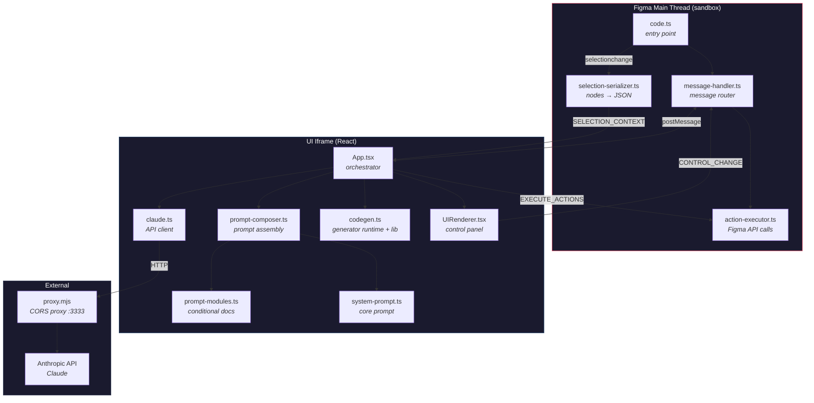
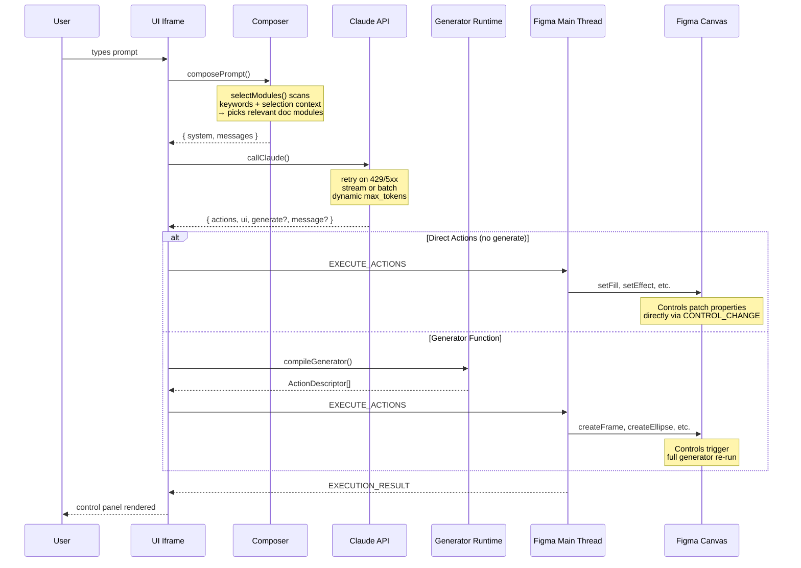
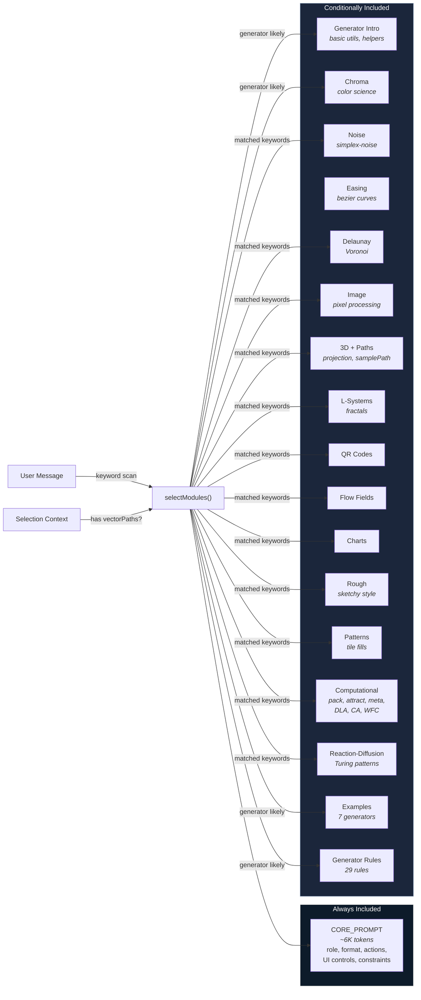
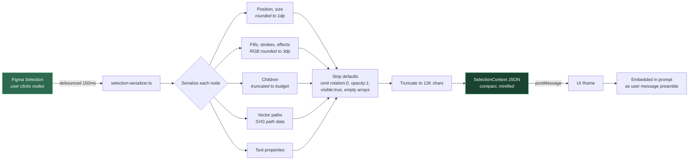
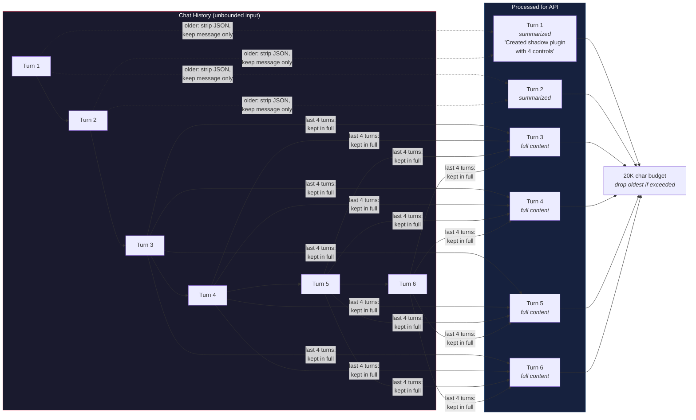

# Architecture

## System Overview

Three isolated environments communicate through message passing and HTTP:

## Request Lifecycle

From user prompt to canvas output:

## Prompt Assembly

How the system prompt is composed per request:

## Selection Context Flow

How Figma node data reaches the LLM:

## Control Interaction Modes

Two distinct paths for how controls update the canvas:

```mermaid
flowchart TB
    subgraph direct["Direct Mode"]
        direction LR
        S1["Slider moved"] --> A1["CONTROL_CHANGE<br/><i>{ controlId, value, action }</i>"]
        A1 --> E1["action-executor<br/><i>patches one property</i>"]
        E1 --> C1["Canvas updated<br/><i>instant, single property</i>"]
    end

    subgraph generator["Generator Mode"]
        direction LR
        S2["Slider moved"] --> D2["Debounce 100ms"]
        D2 --> G2["Re-run generate(params, lib)"]
        G2 --> R2["Delete old children<br/>+ create new"]
        R2 --> C2["Canvas rebuilt<br/><i>full re-render</i>"]
    end

    Note["The LLM decides which mode to use:<br/>Direct for simple property edits,<br/>Generator for computed layouts"]

    style direct fill:#0a1628,stroke:#4cc9f0,color:#fff
    style generator fill:#0a1628,stroke:#f72585,color:#fff
```

## Chat History Management

How conversation history is bounded:

