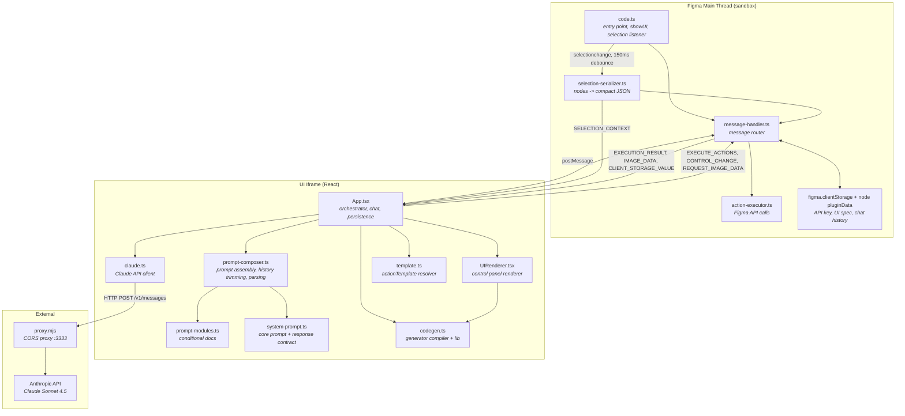
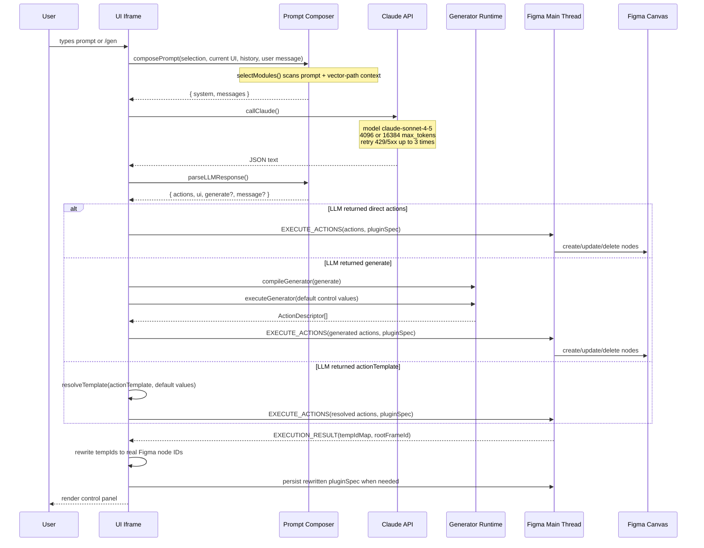
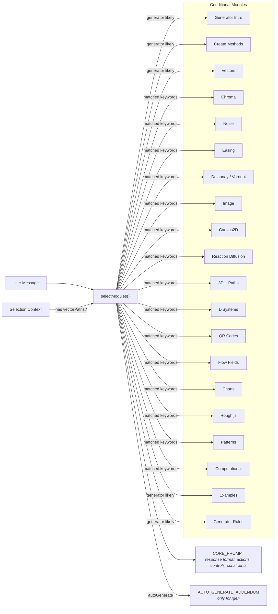
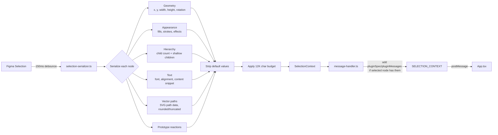
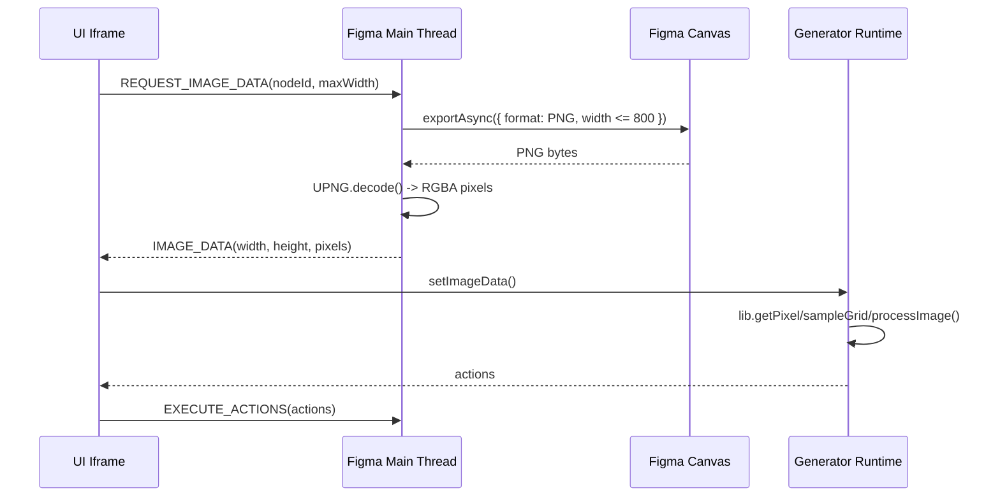

# Architecture

Switches is a standalone Figma plugin with a React iframe, a Figma main-thread executor, and a local Anthropic proxy. The plugin turns a natural-language prompt into two things: structured Figma actions and a declarative control panel.

## System Overview

Three isolated environments communicate through message passing and HTTP:

The main thread owns all `figma.*` calls. The iframe owns React, prompt assembly, API requests, generator execution, Canvas2D image work, and the rendered control panel. The proxy exists because Figma plugin iframes run with a null origin and need local CORS headers to call Anthropic from development builds.

## Request Lifecycle

From prompt to editable canvas output:

`/gen`, `/generate`, and `/auto` use the same loop with an auto-generate addendum. When multiple layers are selected, `App.tsx` first wraps them in a frame so the generated controls have one owner node to persist on.

## Prompt Assembly

The system prompt is built from a core contract plus optional documentation modules:

`composePrompt()` sends selection context and the current UI spec as a contextual preamble, then appends prior chat turns, then the new user message. It keeps the last 4 turns in full, summarizes older assistant messages, enforces a 20K character history budget, and drops oldest turns if the total prompt estimate exceeds 180K tokens.

## Selection Context Flow

`selection-serializer.ts` keeps selection context compact enough for the LLM:

The serializer includes image fills by hash, but pixel data is fetched separately only when a generated spec sets `imageNodeId`.

## Action Execution

The action executor receives `ActionDescriptor[]` and maps each descriptor to Figma API calls. Supported methods:

- `createRectangle`, `createFrame`, `createEllipse`, `createVector`, `createText`
- `setFill`, `setStroke`, `setEffect`, `setProperty`, `setCornerRadius`
- `setLayoutProperties`, `resize`, `appendChild`
- `applyImageFill`, `applyPatternFill`
- `deleteNode`, `deleteChildren`

Execution behavior:

- Actions run sequentially; individual failures are collected and reported without stopping the batch.
- `tempId` values reference nodes created earlier in the same batch.
- `__prev` resolves to the most recently created node.
- `createVector` normalizes SVG path commands into the subset Figma supports.
- Newly created root frames are centered unless `skipCenter` is set.
- Generated frames are post-processed for auto-sizing unless the generator already resized the root frame.
- The executor returns `createdNodeIds`, `tempIdMap`, and `rootFrameId` for iframe-side state updates.

When `pluginSpec` is provided, the executor stores it with `setPluginData('pluginSpec', ...)` on the explicit `persistNodeId`, the root frame, the first created node, or the first targeted node.

## Control Interaction Modes

Controls update the canvas through two paths:

```mermaid
flowchart TB
    subgraph live["Live Mode"]
        direction LR
        L1["Control changes"] --> L2["UIRenderer sends CONTROL_CHANGE"]
        L2 --> L3["message-handler.ts"]
        L3 --> L4["applyControlChange()"]
        L4 --> L5["Canvas property patched"]
    end

    subgraph apply["Apply Mode: generate"]
        direction LR
        A1["Control changes"] --> A2["400ms debounce"]
        A2 --> A3["compile/run generate(params, lib)"]
        A3 --> A4["Reuse root frame if possible"]
        A4 --> A5["resize + deleteChildren + recreate children"]
        A5 --> A6["Persist updated defaultValue state"]
    end

    subgraph template["Apply Mode: actionTemplate"]
        direction LR
        T1["Control changes"] --> T2["resolveTemplate(values)"]
        T2 --> T3["EXECUTE_ACTIONS"]
    end
```

If a spec has `generate`, `UIRenderer` does not send live control patches. It lets `App.tsx` re-run the generator and send a full action batch. Current control values are stamped back into the spec's `defaultValue` fields before persistence so restored panels open with the user's latest settings.

## Generator Runtime

`codegen.ts` compiles LLM-generated JavaScript function bodies with `new Function('params', 'lib', body)`. The result must return an `ActionDescriptor[]`.

The `lib` object bundles deterministic randomness, math helpers, color tools, vector helpers, 3D projection, SVG path sampling, image-processing helpers, computational design algorithms, and libraries such as `chroma-js`, `simplex-noise`, `d3-delaunay`, `paths-js`, `lindenmayer`, `qrcode-svg`, `roughjs`, `stackblur-canvas`, `rgbquant`, and `marchingsquares`.

Generator runs reset the seeded RNG before execution so outputs remain stable when the user changes unrelated controls. A Randomize control can call `lib.reseed()`.

## Image Data Flow

Image processing uses an explicit request/response path:

Vector effects use sampled pixels to create editable shapes. Bitmap effects use Canvas2D helpers to return PNG bytes for `applyImageFill`.

## Persistence And Restore

There are two persistence channels:

- `figma.clientStorage`: stores the Anthropic API key under `apiKey`.
- Node plugin data: stores `pluginSpec` and `pluginMessages` on the generated root node.

Restore flow:

1. The user selects a node.
2. `sendSelectionContext()` serializes the selection.
3. `message-handler.ts` checks the selected node for `pluginSpec` and `pluginMessages`.
4. `App.tsx` parses the stored spec, fixes stale temp IDs if needed, restores controls, and restores chat history.
5. Control changes re-persist the latest values after a short debounce.

`/clear` removes plugin data from the current root node and resets iframe state.

## Message Protocol

Shared message types live in `src/shared/message-types.ts`.

Main -> iframe:

- `SELECTION_CONTEXT`
- `EXECUTION_RESULT`
- `IMAGE_DATA`
- `CLIENT_STORAGE_VALUE`
- `ERROR`

Iframe -> main:

- `PLUGIN_READY`
- `CONTROL_CHANGE`
- `EXECUTE_ACTIONS`
- `REQUEST_IMAGE_DATA`
- `CLEAR_PLUGIN_DATA`
- `PERSIST_MESSAGES`
- `SET_CLIENT_STORAGE`
- `DELETE_CLIENT_STORAGE`
- `CLOSE_PLUGIN`
- `ERROR`

The resize message is intentionally handled outside the typed protocol because it is emitted by the iframe shell as `{ type: 'resize', width, height }`.

## Local Development Boundaries

`npm run build` bundles `src/main/code.ts` to `dist/code.js` and inlines the React iframe bundle into `dist/ui.html`.

`npm run watch` polls `src/` for changes and rebuilds the plugin bundles.

`npm run proxy` starts the Anthropic CORS proxy on `localhost:3333`.

`npm run preview` builds `dist/preview.html` and serves the standalone component preview on `localhost:3333`. It uses the same port as the proxy, so run one at a time.
